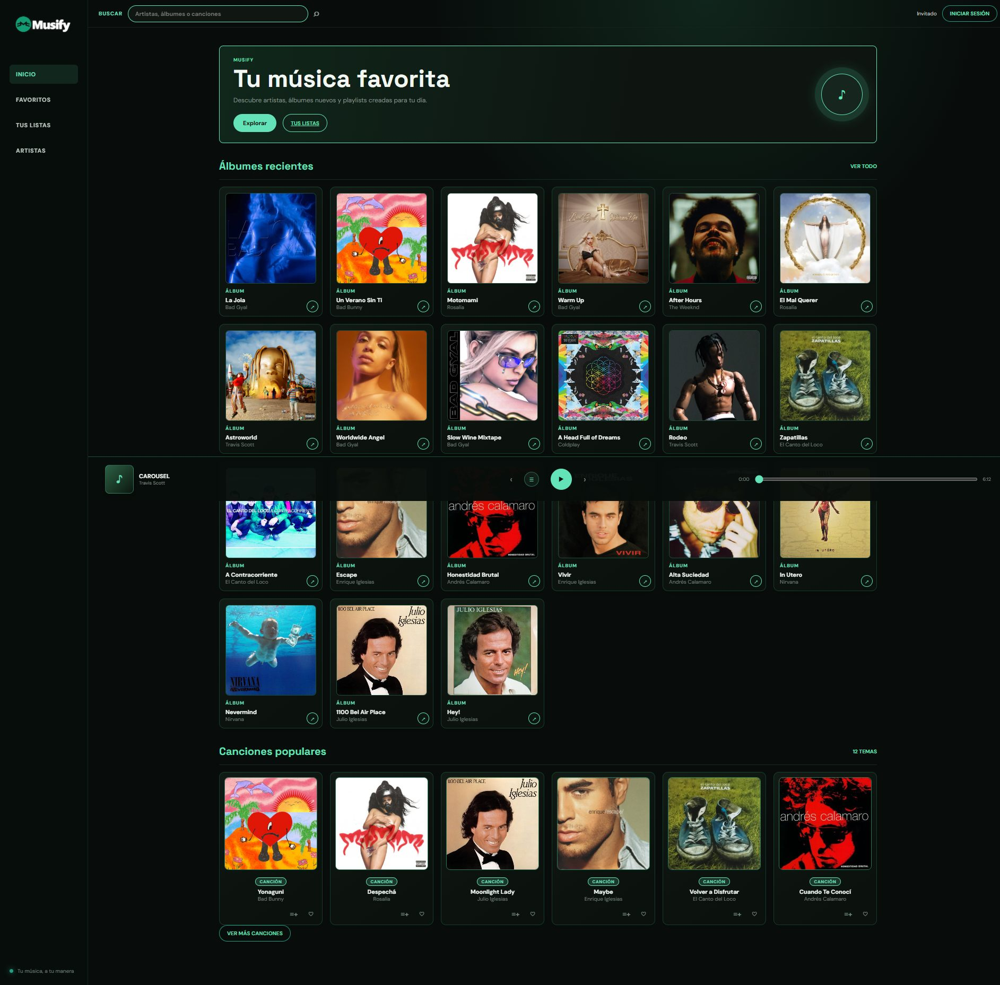
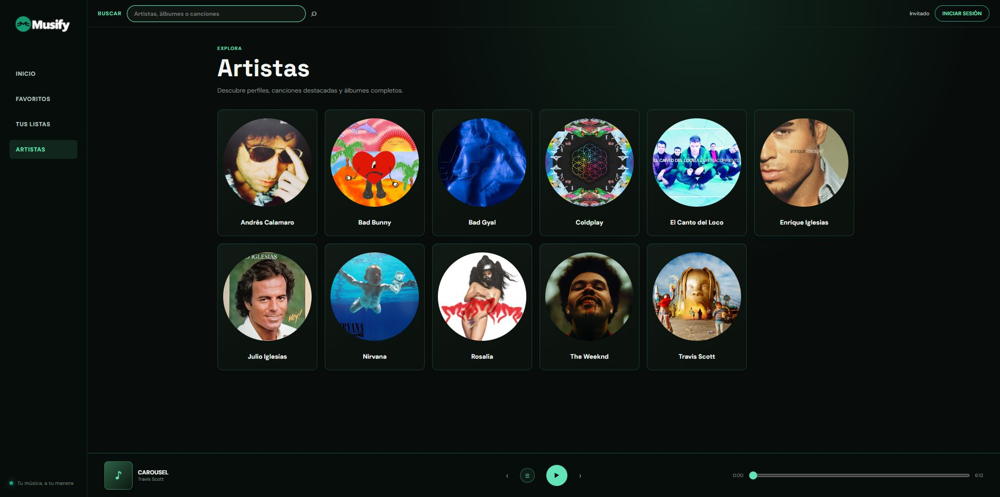
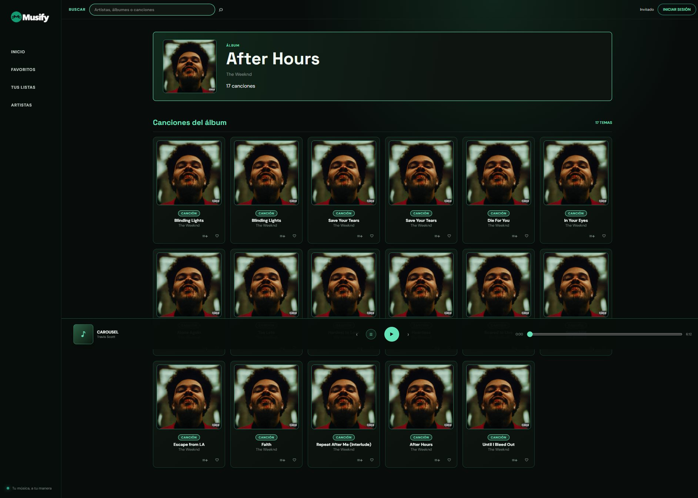

# Musify

Musify es una app de música tipo streaming que combina un frontend en Vue 3 con una API en PHP y MySQL. El proyecto incluye catálogo, búsqueda, artistas, álbumes, favoritos y playlists, con un flujo real de autenticación y gestión de contenido.

## Stack

- Frontend: Vue 3 + Vite
- Backend: PHP + PDO + Apache
- Base de datos: MySQL
- Routing: Vue Router

## Características

- Catálogo de artistas, álbumes y canciones
- Búsqueda general del catálogo
- Perfil de artista y detalle de álbum
- Favoritos por usuario
- Playlists personales
- Reproductor con controles de progreso y cola de reproducción
- Autenticación de usuarios

El audio de las canciones es de demostración y actualmente usa una fuente compartida; no es un catálogo de streaming comercial.

### Cuenta de demostración

- Email: `demo@musify.local`
- Contraseña: `MusifyDemo2026!`

La base completa de demostración incluye favoritos y una playlist para esta cuenta. Es únicamente para la demo local y no debe reutilizarse en producción.

## Capturas

### Inicio y catálogo



### Artistas



### Detalle de álbum



## Estructura

- `frontend/`: aplicación cliente
- `backend/api/`: endpoints PHP
- `database/`: esquema y datos de demostración

## Requisitos

- Node.js 18+
- npm
- PHP 8+
- Apache o XAMPP
- MySQL 8+

## Arranque rápido con XAMPP

1. Clona el repositorio.
2. Copia la app a tu carpeta de XAMPP (por ejemplo `C:/xampp/htdocs/musify`).
3. Crea la base de datos MySQL con el nombre `musify` e importa `database/init.sql` desde phpMyAdmin.
4. Levanta Apache y MySQL en XAMPP.
5. En el frontend:

```powershell
cd frontend
npm install
npm run dev
```

La API queda accesible, por defecto, en:

`http://localhost/musify/backend/api`

Si quieres cambiar la URL base del backend, crea un archivo `.env` dentro de `frontend` con:

```env
VITE_API_URL=http://localhost/musify/backend/api
```

## Arranque con Docker

1. Crea el archivo `.env` a partir del ejemplo:

```powershell
copy .env.example .env
```

2. Levanta la pila:

```powershell
docker compose up --build
```

En un volumen MySQL nuevo, Docker carga `database/init.sql` con el catálogo, favoritos y playlist de demostración. La importación automática ocurre solo la primera vez que se inicializa el volumen; no sobrescribe una base existente.

Para ejecutarlo en segundo plano:

```powershell
docker compose up --build -d
```

Para detenerlo:

```powershell
docker compose down
```

3. Frontend disponible en:

`http://localhost:5173`

4. Backend disponible en:

`http://localhost:8080/backend/api`

## Variables de entorno

Archivo raíz `.env.example`:

```env
APP_ENV=development
MUSIFY_DB_HOST=db
MUSIFY_DB_PORT=3306
MUSIFY_DB_NAME=musify
MUSIFY_DB_USER=musify
MUSIFY_DB_PASSWORD=musify
```

Archivo frontend `.env.example`:

```env
VITE_API_URL=http://localhost:8080/backend/api
```

## Comprobaciones locales

```powershell
cd frontend
npm ci
npm test
npm run build
cd ..
& C:\xampp\php\php.exe backend\tests\smoke.php
```

`npm test` comprueba el orden FIFO y el comportamiento de una cola vacía. La comprobación PHP estructural verifica los archivos principales de la API. GitHub Actions también ejecuta una prueba HTTP de autenticación y favoritos contra MySQL 8, además de comprobar la sintaxis PHP y la configuración de Docker Compose en cada push a `main` y en cada pull request.

### Prueba de integración de la API

La prueba registra un usuario temporal, verifica autenticación y crea, consulta y elimina un favorito. Requiere que MySQL tenga cargados `database/schema.sql` y `database/seed.example.sql`, y que el servidor PHP esté activo desde la raíz del repositorio.

En una terminal PowerShell:

```powershell
$env:MUSIFY_DB_HOST = '127.0.0.1'
$env:MUSIFY_DB_PORT = '3306'
$env:MUSIFY_DB_NAME = 'musify'
$env:MUSIFY_DB_USER = 'musify'
$env:MUSIFY_DB_PASSWORD = 'musify'
& C:\xampp\php\php.exe -S 127.0.0.1:8080 -t .
```

En otra terminal desde la raíz:

```powershell
$env:MUSIFY_TEST_API_URL = 'http://127.0.0.1:8080/backend/api'
& C:\xampp\php\php.exe backend\tests\integration.php
```

GitHub Actions levanta una instancia MySQL 8 aislada, carga el esquema y el seed de ejemplo y ejecuta esta prueba automáticamente.

## Datos y privacidad

- `database/schema.sql` contiene el esquema usado por la CI.
- `database/seed.example.sql` contiene datos mínimos de demostración para pruebas y CI.
- `database/init.sql` es el volcado ficticio completo que usa Docker para recrear el catálogo y el estado de demo. No añadas datos reales ni credenciales personales a este archivo.

La CI conserva el esquema y seed mínimos para probar la API de forma aislada; Docker usa el volcado completo para mostrar la aplicación con el catálogo de demostración.

## Publicar en GitHub

```powershell
git add .
git status
git commit -m "Prepare Musify portfolio project"
git branch -M main
git remote add origin <URL-del-repositorio>
git push -u origin main
```

Sustituye `<URL-del-repositorio>` por la URL de tu repositorio. Comprueba `git status` antes del commit: `database/init.sql` debe aparecer porque contiene datos ficticios de demostración; `.env` no debe aparecer.

## Próximos pasos

- publicar una demo y añadir capturas reales de la aplicación
- sustituir las URLs de audio de demostración por recursos propios o con licencia

## Licencia

Este proyecto se usa como ejemplo de desarrollo y como base para aprendizaje y portfolio profesional.
